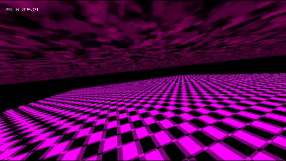

# ✨About This Project

As a game developer with 5+ years of experience in 2D games, I wanted to challenge myself and start learning shaders and [OpenGL with C++](https://github.com/BRUNOO1545/OpenGL-Practices), then I realized that GameMaker is also built on top of the OpenGL / Vulkan graphics API.
 
So I started learning by using GameMaker's manual, online tutorials and Gemini AI (with teacher-like prompt that gives me the theory behind instead of the solution), while understanding the new engine capabilities and limitations for this challenge.

# ⚙ The Technical Challenge

Drawing 3D graphics from scratch isn't as simple as it sounds. To approach this learning process, I choose the "simple" way: using the GameMaker's rendering pipeline. At first, that may sound like the "natural" solution, but it still represents a real technical challenge.

If you take a deep dive into GameMaker's pipeline, you'll notice that the YoYo Runtime runs on a single-threaded process, that's perfectly fine for most 2D games, but for 3D rendering with all its complexity it becomes almost impossible to run efficiently without aggressive optimization techniques.

So here's the plan for the basics:
- Set up a 3D camera
- Create a player with world interaction (Quake-style movement)
- Create a basic skybox (with Quake-style clouds)
- Add motion blur support
- Create a physics normalization system
- Create a procedural world generation algorithm

Remember, we're pushing GameMaker's 2D-oriented architecture into 3D territory. That means working within limitations while applying optimization techniques to improve performance and maximize FPS. With that done, let's begin:

